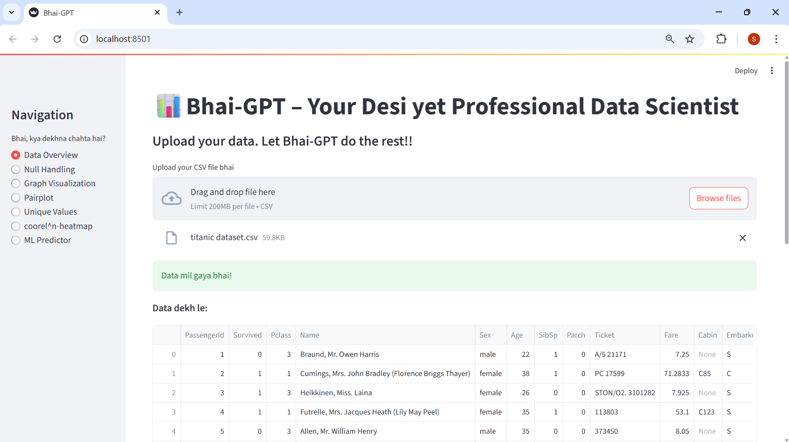
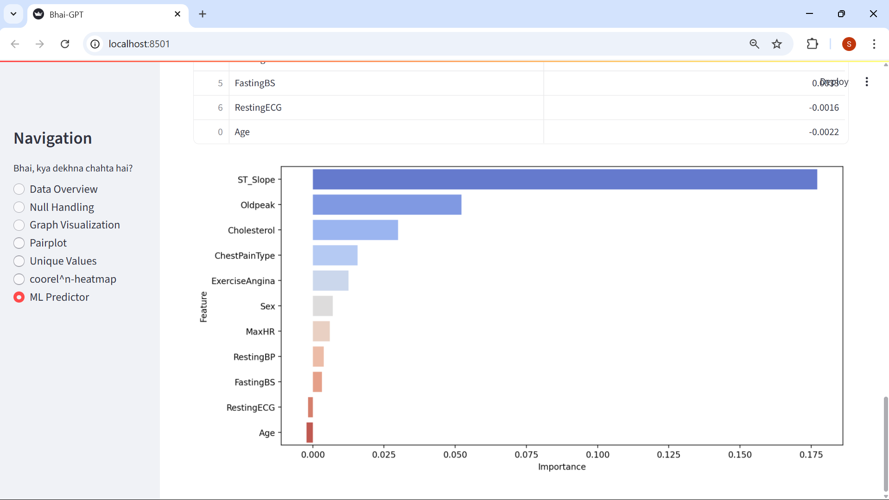
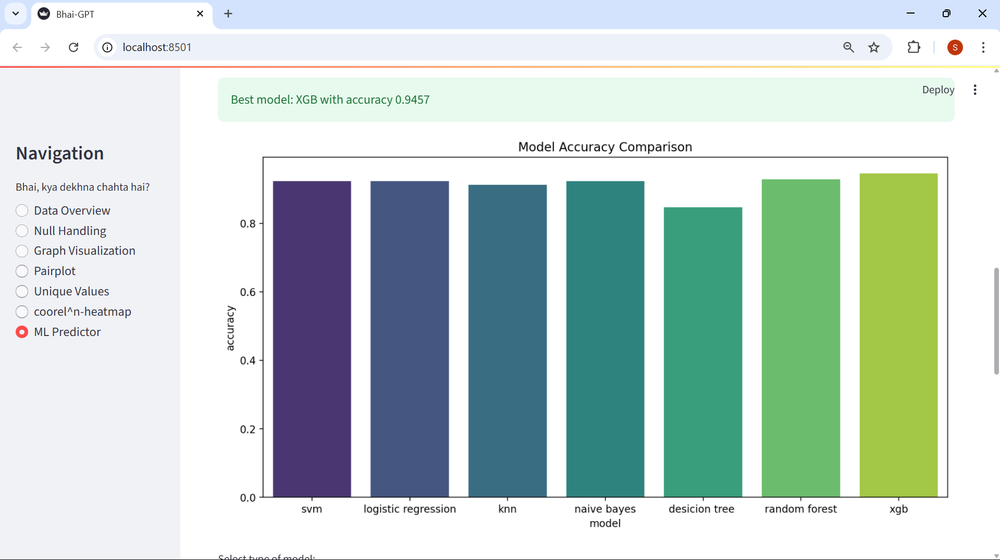
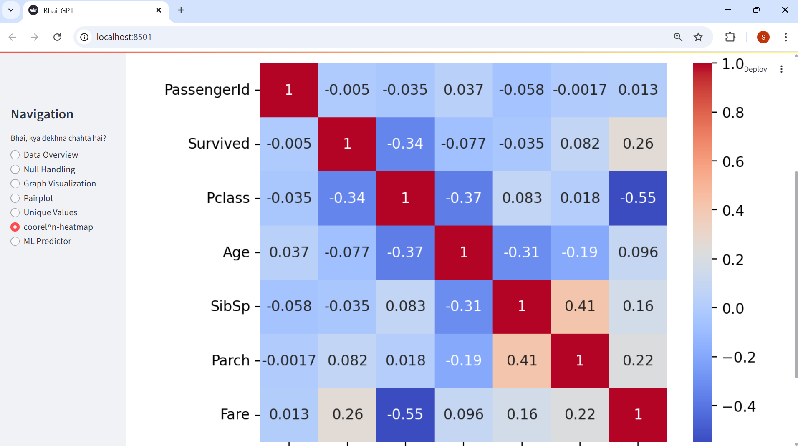

# **Bhai-GPT**

**Bhai-GPT** is a fun, powerful, and fully functional **Streamlit-based data science assistant**.  
Upload any CSV dataset, and Bhai-GPT will analyze, visualize, clean, and even build machine learning models for you — all with a desi touch .


## 📁 Project Structure

```
├── v3.py                     # Main Streamlit app (Bhai-GPT)
├── readme.md                 # Project documentation
├── LICENSE                   # MIT License
├── requirement.txt           # Python dependencies
├── advertising.csv           # Sample dataset for testing
├── titanic dataset.csv       # Another sample dataset
├── Mobile Price Predictor    # Possibly a directory or dataset (rename clearly if needed)
├── SS1.png                   # Screenshot - File Upload & Overview
├── SS2.png                   # Screenshot - Correlation Heatmap
├── SS3_1.png                 # Screenshot - Model Comparison
├── SS3_2.png                 # Screenshot - Feature Importance
```

## 🚀 Features

-  Upload CSV files and get instant insights
-  Auto-generated Data Overview (with shape and description)
-  Null value handling (numeric & categorical)
-  Graph Visualizations (scatter, bar, line, box)
-  Pairplots with categorical hue
-  Unique value analysis
-  Correlation Heatmap
-  ML Predictor for **Classification** and **Regression** (Logistic Regression, SVM, KNN,        Naive Bayes, Decision Tree, Linear Regression)
-  Model Comparison using Accuracy and F1 Score
-  permutation importance is added to inform about importance of a input feature in the specific models

##  Bhai-GPT in Action

### File Upload & Overview


### ML feature importance


### ML Model Comparison


### Correlation Heatmap


>  These are just a few insights. Explore the full Bhai-GPT dashboard to unlock more features.

## 🧰 Tech Stack

-  Python
-  Pandas, NumPy
-  Seaborn, Matplotlib
-  Scikit-learn
-  Streamlit


## 💻 Contributions & Credits

* Fully built and coded by me (Data Science logic, model evaluation, visualizations)


## 📞 Contact

* 🔗 [LinkedIn](https://www.linkedin.com/in/shivam-parihari-40746a325)
* 📫 Email: [pariharishivam59@gmail.com](mailto:pariharishivam59@gmail.com)


## 📄 License
This project is licensed under the [MIT License](LICENSE)

❤️ **Thank you for visiting!** 
